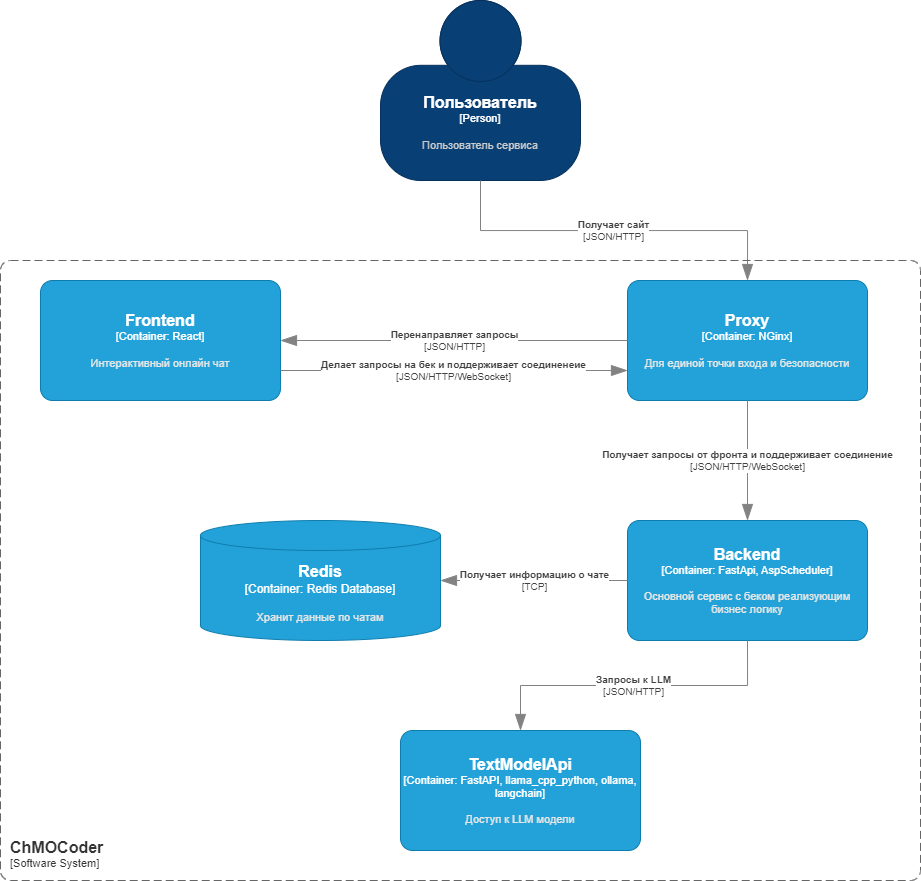

# Проект по дисциплине "Нейроинформатика"

## ChMOCoder - онлайн чат с LLM моделью

## Авторы

| ФИО                          | Группа      |
| ---------------------------- | ----------- |
| Павлов Иван Дмитриевич       | М80-407Б-21 |
| Крючков Артемий Владимирович | М80-407Б-21 |
| Лютоев Илья Александрович    | М80-407Б-21 |

## Презентация проекта

https://docs.google.com/presentation/d/1v-okkSI5phy9HYAVa-BaoX28SymBW1BLEZNtYH7P38Y/edit?usp=sharing

## Отчет

### Описание

**ChMOCoder** — это интерактивный онлайн-чат, в основе которого лежит мощная языковая модель LLaMA. Проект создан для тех, кто стремится эффективно решать задачи программирования, получать экспертные советы по коду или просто экспериментировать с идеями. С помощью ChMOCoder вы можете в реальном времени общаться с искусственным интеллектом, способным понимать контекст, генерировать релевантные ответы и помогать улучшать качество вашего кода. Простой и удобный интерфейс облегчает взаимодействие с моделью и позволяет адаптировать её работу под ваши конкретные задачи — будь то обучение, отладка или поиск вдохновения.

### Бизнес цель проекта

**Бизнес-цель ChMOCoder** заключается в создании универсального инструмента для разработчиков и компаний, который сочетает в себе интерактивное обучение, помощь в разработке программного обеспечения и повышение производительности. Основные направления:

1. **Оптимизация процессов разработки**: Предоставление разработчикам быстрого доступа к решениям задач, улучшение качества и скорости написания кода, устранение ошибок на ранних стадиях.

2. **Поддержка обучения и развития навыков**: Включение в процесс обучения как новичков, так и опытных разработчиков через интерактивные объяснения, примеры и рекомендации.

3. **Снижение затрат на разработку и обучение**: Замена дорогостоящих консультаций и обучения специалистами на автоматизированные решения с поддержкой искусственного интеллекта.

ChMOCoder нацелен на широкую аудиторию — от индивидуальных разработчиков и образовательных учреждений до крупных корпораций, стремящихся автоматизировать рутинные задачи, повысить квалификацию своих специалистов и внедрить новые технологии в процесс разработки.

### ML-цель проекта

1. **Генерация качественного кода**: Обеспечение способности модели генерировать оптимальный, понятный и эффективный код для решения задач на различных языках программирования.

2. **Отладка и исправление ошибок**: Разработка функционала для анализа кода, выявления ошибок и предложений по их исправлению с объяснением причин.

3. **Адаптация к разным уровням знаний**: Внедрение механизмов, позволяющих модели адаптировать ответы в зависимости от уровня подготовки пользователя — от начинающего до профессионала.

### Архитектура (схема C4)



### Обоснование архитектуры

Данная схема была реализована с целью возможности балансировки и поддержки высокой нагрузки. Для этого мы сделали следующее:
1. Разделили llm и бизнес-логику на отдельные сервисы (TextModelApi и Backend) для того чтобы можно было регулировать нагрузку между ними.
2. В сервисе бекенда ввели отложенный вызов метода вызова непосредственно llm с баланисировкой нагрузки на нее.
3. Для поддержки асинхронного взаимодействия с пользователем мы использовали вебсоккет работающий в режиме публикации событий, то есть если пользователь отправил запрос к llm, то он не сразу получает ответ, а ждет события в котором он будет.
4. Для хранения чатов мы использовали Redis как базу данных, так как у нас не нет тяжелой взаимосвязанной модели данных и нам требуется хранить только историю чатов в виде json документов и понимать существовал ли данный чат. Также редис имеет возможность настройки автоматического удаления записей по прошествию времени, а так как мы позиционируем наш сервис как сервис временных чатов, то данная фича очень нам к месту.

### Объяснение выбора используемого стека

#### **React + TypeScript** для фронтенда

#### 1. **React**

React – популярная JavaScript-библиотека для создания пользовательских интерфейсов.

**Преимущества React:**

- **Компонентный подход:**
  Позволяет разделять интерфейс на изолированные и повторно используемые компоненты, упрощая разработку и поддержку.
- **Virtual DOM:**
  Высокая производительность за счёт минимизации операций с реальным DOM.
- **Большая экосистема:**
  Множество готовых библиотек и инструментов (React Router, Redux, React Query и др.), упрощающих разработку сложных приложений.
- **Активное сообщество:**
  Регулярные обновления, множество обучающих ресурсов и примеров.
- **Поддержка современного JavaScript:**
  React использует такие возможности, как ES6+, Hooks, Context API, что упрощает разработку и улучшает читаемость кода.

---

#### 2. **TypeScript**

TypeScript – надстройка над JavaScript, добавляющая строгую типизацию.

**Преимущества TypeScript:**

- **Статическая типизация:**
  Позволяет выявлять ошибки на этапе написания кода, уменьшая количество багов на продакшене.
- **Улучшенный IntelliSense:**
  TypeScript обеспечивает автодополнение и рефакторинг, что ускоряет разработку.
- **Совместимость с JavaScript:**
  TypeScript полностью компилируется в JavaScript, что позволяет использовать существующий код или библиотеки.
- **Лучшее документирование кода:**
  Типы служат самодокументацией, что облегчает чтение и понимание кода.
- **Совместимость с React:**
  TypeScript прекрасно работает с React через обобщённые типы (Generics) и типизацию компонентов.

---

#### Почему вместе: React + TypeScript?

Использование React с TypeScript объединяет лучшие стороны обеих технологий:

1. **Повышенная надёжность кода:**
   Типы позволяют предотвратить распространённые ошибки, например, передачу неверных пропсов в компоненты.
2. **Чистота кода:**
   React-компоненты становятся лучше документированными благодаря декларации типов.
3. **Удобство для крупных приложений:**
   При масштабировании проекта типизация помогает легко вносить изменения и сохранять высокую читаемость кода.
4. **Лучший опыт разработчиков:**
   TypeScript интегрируется с IDE (например, VSCode), предоставляя подсказки и предупреждения.

---

#### **Python** для API с LLM моделью
- **Удобство интеграции с LLM моделями:** 
  Python имеет широкую экосистему библиотек для работы с искусственным интеллектом и машинным обучением (например, PyTorch, TensorFlow, Hugging Face). Это делает его лучшим выбором для создания API, взаимодействующего с LLM.
- **Простота разработки:** 
  Высокая читаемость кода и множество готовых решений позволяют быстро разрабатывать и поддерживать приложения.
- **Асинхронность:** 
  Python поддерживает асинхронные операции (asyncio), что идеально подходит для работы с I/O-интенсивными задачами, такими как обработка API-запросов.
- **Сообщество и документация:** 
  Python активно используется для создания API, что обеспечивает доступ к большому количеству примеров и инструментов.

---

#### **FastAPI** для WebSocket и REST API
- **Асинхронная работа:**
  FastAPI построен на основе `asyncio` и поддерживает высокопроизводительные WebSocket и REST-запросы, что необходимо для обработки большого количества одновременных запросов к модели.
- **Высокая производительность:**
  Использует Uvicorn и Starlette, что обеспечивает производительность на уровне Node.js и Go.
- **Поддержка WebSocket:**
  WebSocket удобен для работы в режиме реального времени (например, для потокового вывода ответа модели).
- **Автоматическая генерация документации:**
  FastAPI автоматически создаёт спецификации Swagger и OpenAPI, что ускоряет интеграцию и тестирование API.
- **Простота работы с типами:**
  FastAPI поддерживает аннотации типов Python, что улучшает читаемость и упрощает отладку.

---

#### **APScheduler** для балансировки нагрузки
- **Планировщик задач:**
  APScheduler позволяет создавать фоновые задачи для анализа нагрузки и перераспределения ресурсов.
- **Поддержка сложных расписаний:** 
  Подходит для выполнения периодических операций, таких как мониторинг загрузки серверов и оптимизация очередей запросов.
- **Асинхронная интеграция:** 
  Работает с `asyncio`, что делает его совместимым с FastAPI.
- **Лёгкость конфигурации:** 
  Прост в настройке и интеграции с Kubernetes и другими компонентами стека.

---

#### **Redis** для общей оперативной памяти и БД
- **Высокая скорость:**
  Redis – это in-memory база данных, идеально подходящая для обработки высоконагруженных приложений.
- **Кэширование запросов:** 
  Позволяет хранить предварительно рассчитанные ответы модели или данные, минимизируя повторные вызовы.
- **Поддержка pub/sub:** 
  Удобно для работы с WebSocket, где требуется организация событийных систем.
- **Репликация в Kubernetes:** 
  Redis хорошо масштабируется и поддерживает создание реплик в распределённой среде, что критично для устойчивости системы.
- **Удобная структура данных:**
  Поддержка списков, хэш-таблиц, строк и других структур упрощает реализацию очередей и других механизмов управления задачами.

---

#### **Nginx** для проксирования запросов и раздачи статики
- **Реверсивный прокси:** 
  Nginx позволяет распределять входящие запросы между разными экземплярами приложения, поддерживая балансировку нагрузки.
- **Поддержка статики:** 
  Удобен для раздачи статических файлов (например, интерфейса или документации).
- **Безопасность:** 
  Добавляет уровень безопасности через настройки HTTPS, ограничение доступов и защиту от DDoS-атак.
- **Высокая производительность:**
  Nginx оптимизирован для работы с большим количеством одновременных соединений.

---

#### **Docker и Kubernetes** для контейнеризации и оркестрации
- **Docker:**
  - Изолирует приложение и его зависимости, что обеспечивает одинаковую среду работы на всех этапах — от разработки до продакшена.
  - Упрощает развертывание и тестирование.
- **Kubernetes:**
  - **Репликация:** Kubernetes позволяет легко масштабировать приложение, создавая несколько реплик сервисов, чтобы выдерживать высокую нагрузку.
  - **Автоскейлинг:** Поддерживает автоматическое добавление/удаление ресурсов в зависимости от нагрузки.
  - **Оркестрация сервисов:** Упрощает управление взаимосвязью между сервисами, например, взаимодействие FastAPI, Redis и базы данных.
  - **Мониторинг и устойчивость:** Kubernetes автоматически перезапускает контейнеры в случае их сбоя, что повышает отказоустойчивость.

### Описание сетей (DMZ, Secure zone и т.д.)

Проект реализует микросервисную архитектуру с разделением на следующие сетевые зоны:

#### **DMZ (Demilitarized Zone)**
- **Сервисы**: `proxy`, `frontend`.
- **Функция**: Обработка внешних запросов.
- **Открытые порты**:
  - `proxy`: 80 (HTTP), 443 (HTTPS).
- **Безопасность**:
  - Шифрование данных через SSL/TLS.
  - Ограничение доступа к внутренним сервисам.

#### **Secure Zone**
- **Сервисы**: `backend`, `text-model-api`, `redis`.
- **Функция**: Внутренние вычисления и хранение данных.
- **Открытые порты**:
  - `backend`: 8000 (для `frontend`).
  - `text-model-api`: 8001 (для `backend`).
  - `redis`: 6380 (с паролем, доступен только внутренним сервисам).
- **Безопасность**:
  - Доступ возможен только внутри сети `network`.
  - Парольная защита для `redis`.

#### **Logging and Management**
- Логи для всех сервисов ограничены по размеру (`max-size`, `max-file`).
- Управление сетью и переменными окружения через `.env`.

## Конфигурация проекта

1. Создать ssl-сертификаты на свой домен (или самоподписные для localhost) и добавить их [сюда](https://github.com/oldpivaldi/ChMOCoder/tree/main/src/proxy/ssl) согласно инструкции.

2. Скачать модель llama с расширением .gguf и добавить ее [сюда](https://github.com/oldpivaldi/ChMOCoder/tree/main/src/text_model_api/repo) согласно инструкции.

3. [Сюда](https://github.com/oldpivaldi/ChMOCoder/blob/main/src/text_model_api/.env) в поле TEXT_MODEL_NAME вписать название файла модели из п.2.

4. [Здесь](https://github.com/oldpivaldi/ChMOCoder/blob/main/src/proxy/nginx.conf) вписать свой домен в директиву server_name.

5. Также изменить конфиги сервисов под свой домен [здесь](https://github.com/oldpivaldi/ChMOCoder/blob/main/src/frontend/.env), [здесь](https://github.com/oldpivaldi/ChMOCoder/blob/main/src/backend/.env) и [здесь](https://github.com/oldpivaldi/ChMOCoder/blob/main/src/text_model_api/.env).

## Запуск проекта

1. Проверить, что порты 80, 443, 8000, 8001, 5174 и 6380 свободны. Также возможно убрать mapping портов (кроме 80 и 443) в манифестах.

2. Воспользоваться инструкциями по сборке через docker-desktop или k8s (minicube).

3. В любом случае сервис находится по адресу https://<ваш_домен> (по умолчанию https://localhost).

## Инструкция по сборке в docker-compose

1. Находясь в корневой директории проекта, прописать данную команду:

```
docker compose -f ./docker-compose.yml up --build -d
```

## Инструкция по сборке в k8s

1. Запустить minikube:

```
minikube start --driver=docker
```

2. Копировать volume:

```
tar -czf proxy-ssl.tar.gz -C ./src/proxy .
```

```
minikube cp proxy-ssl.tar.gz /home/docker/
```

```
minikube ssh -- tar -xzf /home/docker/proxy-ssl.tar.gz -C /home/docker/
```

```
tar -czf model-repo.tar.gz -C ./src/text_model_api/repo .
```

```
minikube cp model-repo.tar.gz /home/docker/
```

```
minikube ssh -- tar -xzf /home/docker/model-repo.tar.gz -C /home/docker/
```

3. Зайти в директорию с манифестами:

```
cd k8s-manifests
```

4. Использовать локальный образ Docker внутри minikube:

```
eval $(minikube docker-env)
```

5. Собрать все образы:

Proxy:

```
docker build -t proxy-image ../src/proxy
```

Frontend:

```
docker build -t frontend-image ../src/frontend
```

Backend:

```
docker build -t backend-image ../src/backend
```

Model:

```
docker build -t text-model-api-image ../src/text_model_api
```

6. Применить манифесты:

```
kubectl apply -f namespace.yaml
kubectl apply -f redis-config.yaml
kubectl apply -f redis-deployment.yaml
kubectl apply -f backend-deployment.yaml
kubectl apply -f frontend-deployment.yaml
kubectl apply -f proxy-deployment.yaml
kubectl apply -f text-model-api.yaml
```

7. Прокинуть порт 443 до minikube

```
sudo kubectl --kubeconfig /home/<ваш_пользователь>/.kube/config port-forward -n chmocoder service/proxy 443:443
```

8. Снова использовать docker-desktop (после завершения)

```
eval $(minikube docker-env --unset)
```
